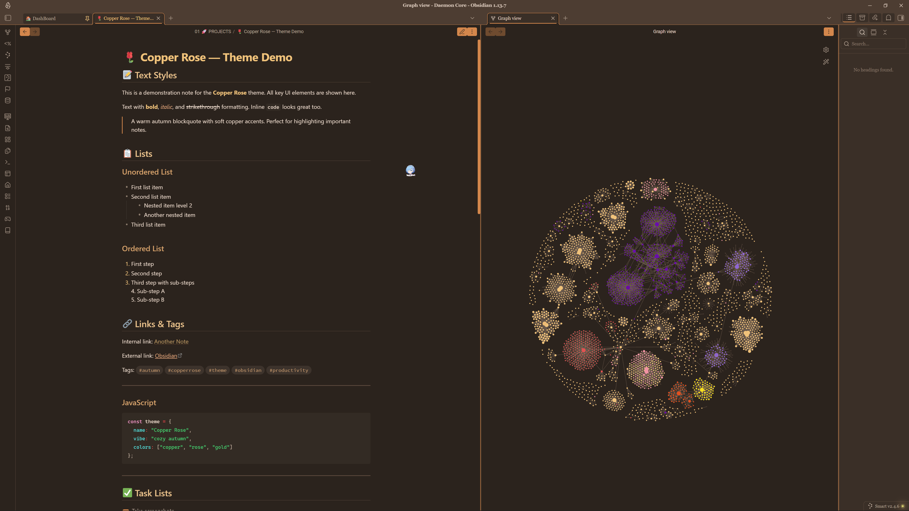
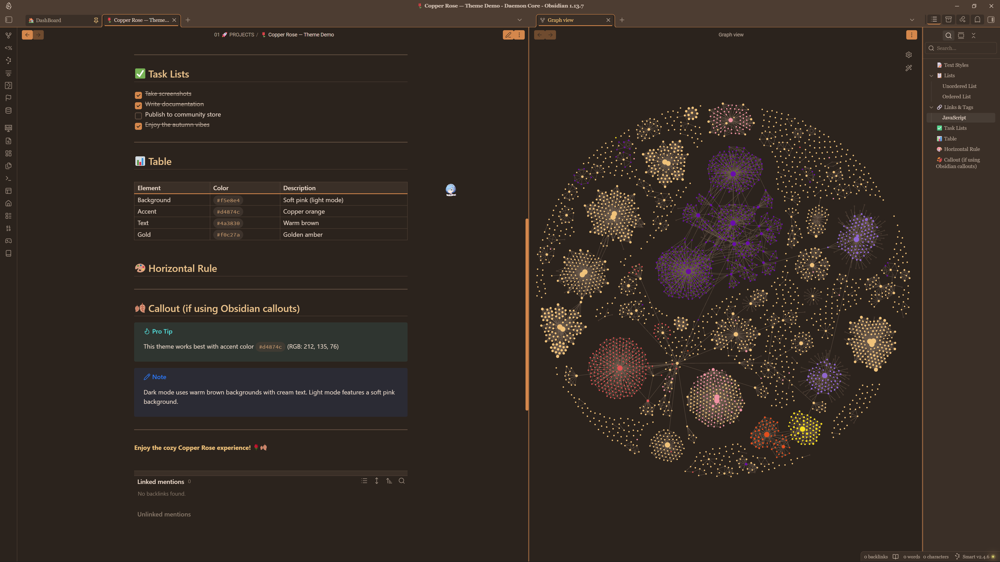
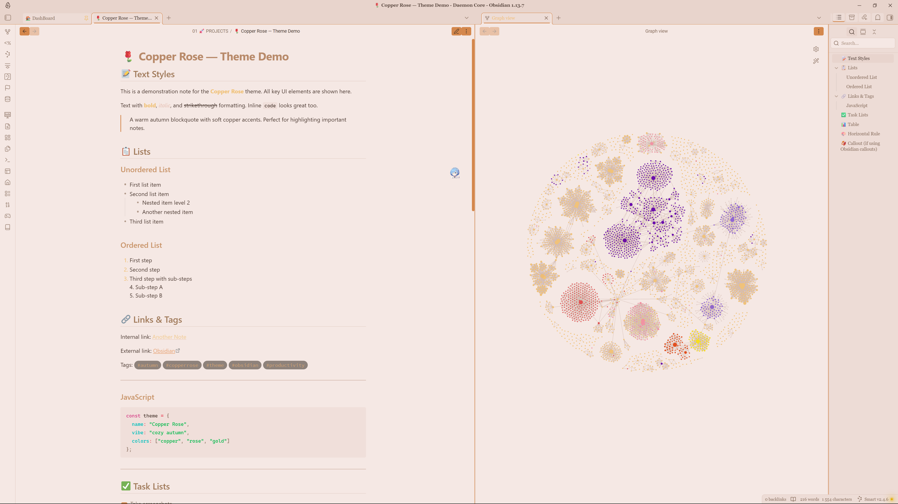
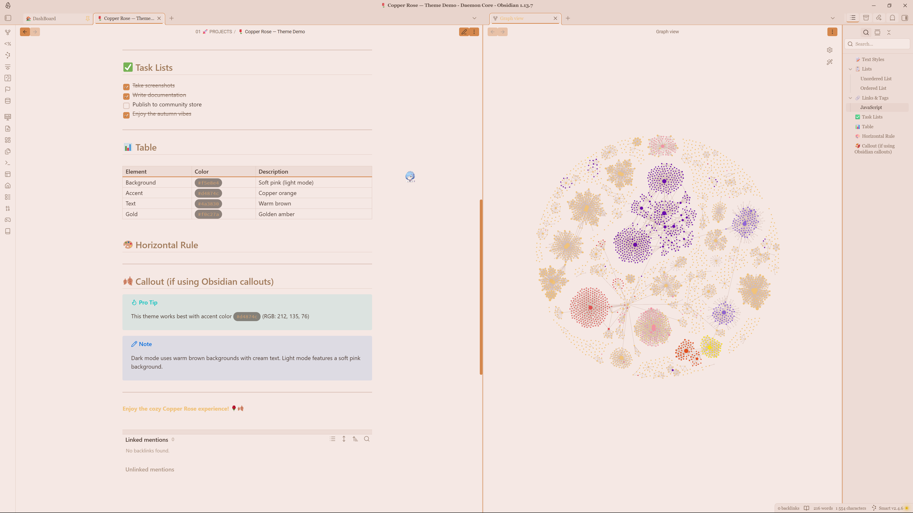

# 🌹 Copper Rose - Obsidian Theme

A warm, cozy autumn theme for [Obsidian](https://obsidian.md) with soft pink undertones and golden amber accents.

---
## ✨ Features

- 🎨 Warm autumn color palette with copper and rose tones
- 🌓 Dark and light mode support
- 🌸 Soft pink background in light mode for comfortable reading
- 📝 Book-like typography with Georgia and Playfair Display fonts
- 🎯 WCAG-compliant contrast for accessibility
- ✨ Hardcoded accent colors that override user settings
- 🍂 Custom styled elements: tags, checkboxes, blockquotes, and callouts
- 🖊️ Smooth animations and transitions

---
## 📸 Screenshots

### Dark Mode





### Light Mode




---
## 📦 Installation

### From Obsidian Community Themes
1. Open Obsidian Settings
2. Go to **Appearance** → **Themes** → **Manage**
3. Search for "Copper Rose"
4. Click **Install** and then **Use**

### Manual Installation
1. Download the `theme.css` and `manifest.json` files
2. Create a folder called `Copper Rose` in your `.obsidian/themes/` directory
3. Place both files in this folder
4. Enable the theme in Obsidian Settings → Appearance → Themes

---
## 🎨 Color Palette

### Dark Theme
- Background: `#2b231d` (warm dark brown)
- Text: `#e8d6c8` (cream)
- Accent: `#d4874c` (copper orange)
- Highlights: `#f0c27a` (golden)

### Light Theme
- Background: `#f5e8e4` (soft pink)
- Text: `#4a3830` (warm dark brown)
- Accent: `#d4874c` (copper orange)
- Highlights: `#f0c27a` (golden)

---
## 🛠️ Customization

### Changing Colors
You can customize the theme by editing the CSS variables in `theme.css`:

```css
--autumn-gold: #f0c27a;    /* Change to your preferred gold */
--autumn-orange: #d4874c;  /* Change to your preferred orange */
--autumn-terracotta: #b5653b; /* Change to your preferred terracotta */